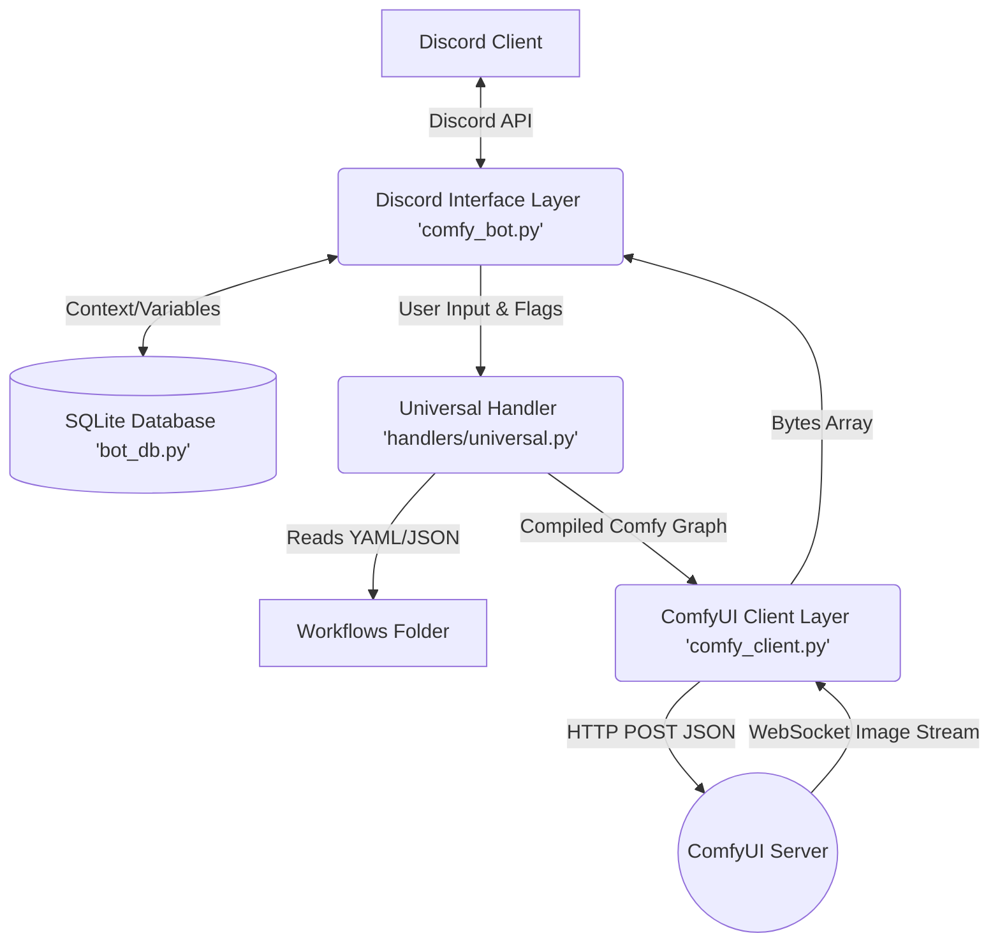
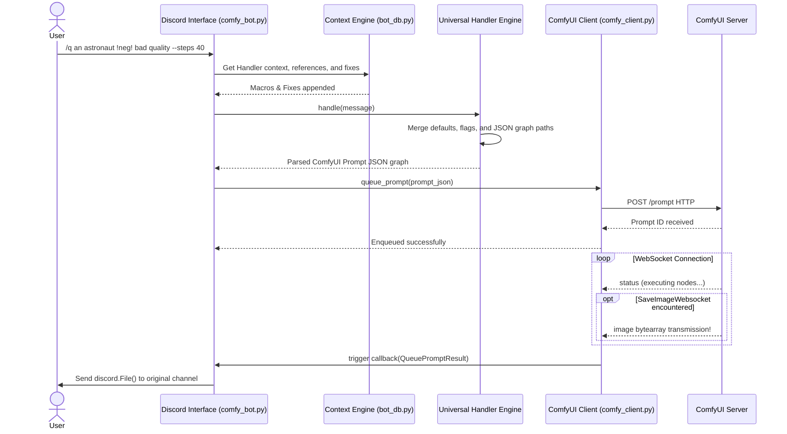

# ComfyUI Discord Bot - Architecture and Design Document

## 1. System Overview

The **ComfyUI Discord Bot** serves as a robust bridging layer between Discord users and a ComfyUI backend server. Its primary goal is to abstract the complexities of ComfyUI's internal node APIs and allow developers/administrators to effortlessly expose complex Generative AI workflows directly to a Discord server using natural language commands, flags, and macros.

The core philosophy revolves around a **Data-Driven Universal Handler Architecture**, which enables adding entirely new generative capabilities (e.g., text-to-image, image-to-image, video generation, upscale) without writing or recompiling any Python code.

---

## 2. High-Level Architecture

The bot is composed of four primary subsystems:

1. **Discord Interface Layer** (`comfy_bot.py`): Manages the Discord API interactions, slash commands, Modals/UI views, and asynchronous queue processing.
2. **Context & Persistence Layer** (`bot_db.py`, `comfy_handlers_manager.py` - Context): A SQLite-backed data layer storing dynamic prompt modifiers (refs, prefixes, flags) allowing personalization of outputs per handler.
3. **Workflow Parsing Engine** (`handlers/universal.py`, `comfy_handlers_manager.py` - Manager): The engine that merges user inputs, user context, and YAML definitions into a strictly compliant ComfyUI JSON payload.
4. **ComfyUI Client Layer** (`comfy_client.py`): A hybrid REST API and WebSocket client operating asynchronously to trigger workflows, monitor their progress, and intercept the resulting images back into the bot's memory space.

---

## 3. Component Details

### 3.1 Discord Interface (`comfy_bot.py`)
- **Slash Commands**: Provides commands like `/q` (queue prompt), `/handlers` (switch workflow), `/handler-info` (describe flags), and `/ref-set` (setup prompt macros).
- **Asynchronous Loop Pattern**: The module registers `publish_images()` as a persistent background asyncio task. Instead of waiting synchronously on each user request, `/q` commands are processed and dispatched, returning immediately. Once `ComfyClient` fulfills the prompt through the WebSocket, it pushes the payload into `queue_prompt_results`. The background loop polls this array and ships the Discord `File` objects efficiently.

### 3.2 Dynamic Workflow Engine (`UniversalHandler`)
Earlier versions of the bot required explicit python classes (`Txt2ImgHandler`, `Img2ImgHandler`) hardcoded to map user strings to JSON paths. This has been deprecated in favor of the **Universal Handler**.

- **Auto-Discovery**: `ComfyHandlersManager` watches the `workflows/` folder. Every `.yaml` and matching `.json` paired file is inherently registered as an available handler on startup.
- **YAML Mappings**: Defines how Discord flags (`--steps`, `--cfg`, `--res`) interface with the API JSON path (e.g., `["4", "inputs", "steps"]`).
- **Implicit Configurations**: Exposes features like the `positive-prompt`, `negative-prompt` (separated by `!neg!`), and contextual default fallbacks natively. It supports resolving grouped values (`--res 512x768` -> split by `x` into width and height).

### 3.3 Context Engine & Database (`bot_db.py`)
Relies on **SQLAlchemy + SQLite**. Contains three main domains:
1. `GlobalSettings`: Maintains the active singleton handler across the Discord environment (e.g., active workflow).
2. `HandlerReferences`: Enables users to define string shortcuts or variables (e.g., `/ref-set character "a knight in shining armor"` -> using `#character` in the prompt will replace it with the exact value).
3. `HandlerFixes`: Configures permanent modifications applied globally when inside a specific workflow, such as a fixed `--cfg` flag, or prefixing `"masterpiece, best quality, "` before the users' prompt automatically.

### 3.4 ComfyUI Networking (`comfy_client.py`)
A highly specialized HTTP and Websocket dispatcher.
- When `_connect_websocket` initializes, it binds to the ComfyServer using a `UUID` client ID via WS.
- It tracks executing events (`data['prompt_id']`) mapping it up to user commands asynchronously.
- Requires workflows to contain a specialized `save_image_websocket_node`. This skips writing to the ComfyUI disk and exposing an HTTP `/view` endpoint. Instead, the image bytes stream through the WebSocket securely, directly into the Discord bot machine memory, greatly accelerating delivery.

---

## 4. Execution Data Flow

1. **User Action**: The User types `/q an astronaut !neg! bad quality --steps 40`.
2. **Context Resolution**: `comfy_bot.py` accesses DB via `ComfyHandlersContext`. It prepends/appends saved fixes and resolves all `#macro` definitions inside the message.
3. **Handler Parsing**: `process_message` invokes `UniversalHandler.handle(message)`.
    - It deeply copies the original Comfy JSON API format.
    - Resolves `--steps 40` routing it to the precise `node_idX -> inputs -> steps` JSON block as mapped by `yaml`.
    - Maps `an astronaut` and `bad quality` to the connected `text` inputs based on implicit definitions.
4. **Queueing**: The completed JSON graph is passed to `ComfyClient.queue_prompt(prompt, callback)`. An HTTP `POST /prompt` pushes the job to the backend GPU server.
5. **WebSocket Tracking**: A threaded task listens via WebSocket. It tracks progress. When the node terminates at the `SaveImageWebsocket`, it collects the bytearray data.
6. **Task Fulfillment**: It fires the callback function binding the bytes to the Discord command `ctx` inside a `QueuePromptResult` object.
7. **Delivery**: The active `publish_images()` asyncio loop fetches the queued result, builds `discord.File(io.BytesIO(...))` and fires it safely into the origin message channel.