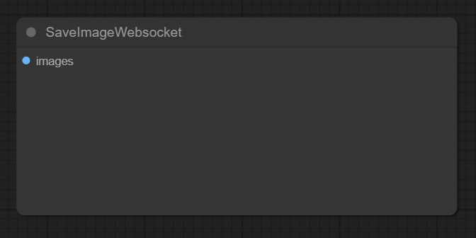

# Workflow Handlers

TODO

# Nodes required for integration

The following nodes are a must for workflow that is handled by a handler.

## SaveImageWebsocket

This node should input the final images of the workflow, sending images to this node will result in images to be published by the bot back to the user.

# Built In Handlers

## Text 2 Image

Simple basic workflow that does not require any additional custom nodes.

#### Supported Flags:

Flags can be added to the message to control specific parameters in the prompts that will be passed to comfy. The flags and their values will be omitted from the final prompts.

| Flag      | Description                                                     | Default                                                |
|-----------|-----------------------------------------------------------------|--------------------------------------------------------|
| --res     | resolution in format of `height:width`                          | 768x768                                                |
| --steps   | amount of steps `[1:]`                                       | 25                                                     |
| --seed    | seed value `int`                                                | random                                                 |
| --cfg     | CFG value `int`                                                 | 7                                                      |
| --batch   | the amount of images to generate `[1:]`                      | 1                                                      |
| --ckpt    | the path to the checkpoint in comfy `models/checkpoint` folder. | sdxl\Juggernaut-XL_v9_RunDiffusionPhoto_v2.safetensors |
| --sampler | the sampler to use `supported name`                             | euler                                                  |
| --schd    | the scheduler to use `supported name`                           | normal                                                 |

#### Special tokens

| Token | Description                                                                                                                                                                                          |
|-------|------------------------------------------------------------------------------------------------------------------------------------------------------------------------------------------------------|
| !neg! | if this token present in the message it will split the message into 2 parts. first part will be positive prompt, the second one negative. if not present message is considered positive prompt only. | 

## Image 2 Image

Basic image to image workflow.

Image is given as a url via --url flag.

Requires: https://github.com/glowcone/comfyui-load-image-from-url custom node to be able to load images from urls.

**Note**: the resolution is set by the input image!

#### Supported Flags:

Flags can be added to the message to control specific parameters in the prompts that will be passed to comfy. The flags and their values will be omitted from the final prompts.

| Flag      | Description                                                     | Default                                                                           |
|-----------|-----------------------------------------------------------------|-----------------------------------------------------------------------------------|
| --steps   | amount of steps `[1:]`                                          | 20                                                                                |
| --seed    | seed value `int`                                                | random                                                                            |
| --cfg     | CFG value `int`                                                 | 8                                                                                 |
| --ckpt    | the path to the checkpoint in comfy `models/checkpoint` folder. | sdxl\Juggernaut-XL_v9_RunDiffusionPhoto_v2.safetensors                            |
| --sampler | the sampler to use `supported name`                             | dpmpp_2m                                                                          |
| --schd    | the scheduler to use `supported name`                           | normal                                                                            |
| --url     | the url to source image `valid url`                             | https://raw.githubusercontent.com/comfyanonymous/ComfyUI/master/input/example.png |
| --denoise | the denoise to use `[0:1]`                                      | 0.87                                                                              |

#### Special tokens

| Token | Description                                                                                                                                                                                          |
|-------|------------------------------------------------------------------------------------------------------------------------------------------------------------------------------------------------------|
| !neg! | if this token present in the message it will split the message into 2 parts. first part will be positive prompt, the second one negative. if not present message is considered positive prompt only. | 

# Custom Handlers

The bot supports in loading dynamically handlers from the `custom_handlers` folder. just put your handlers module in similar way to the built-in [handlers](../handlers/) module.

If your module is a git repo, just git clone into the `custom_handlers` folder and reboot the bot.