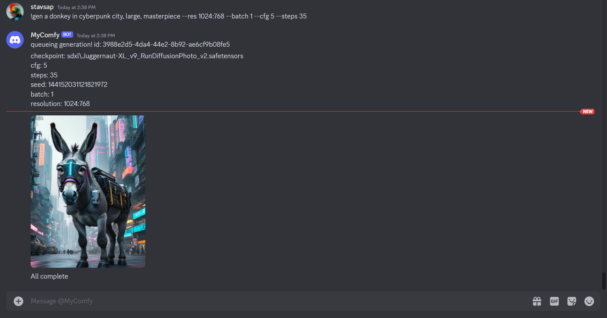

# ComfyUI Discord Bot

The following is a project for private (can be public) Discord bot integrated with [ComfyUI](https://github.com/comfyanonymous/ComfyUI).

Makes usage of [pycord](https://guide.pycord.dev/installation), also check [pycord github](https://github.com/Pycord-Development/pycord/)

## 🚦 WIP 🚦

<a href="https://www.buymeacoffee.com/stavsapq" target="_blank"></a>




## Setup

Install dependencies:

```shell
python -m pip install -r requirements.txt
```

## Bot Setup

For Bot creation and integration check the [docs](Docs/BotSetup.md)

To run the bot after creating and obtaining the bot Token, set environment variables:


| Env Var | Default | Required? |
|---------|---------|-----------|
| DISCORD_BOT_API_TOKEN  |     | YES       |
| COMFY_UI_ADDRESS | 127.0.0.1:8188    | NO        |

# Contribution

If you want to contribute, feel free to fork the repository and submit a Pull Request. When creating the PR, please provide a high-level description of the changes or new feature being merged.